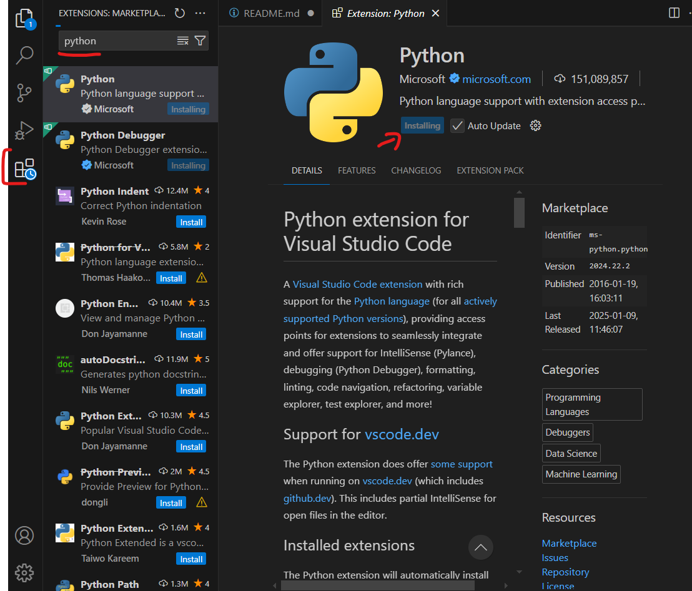
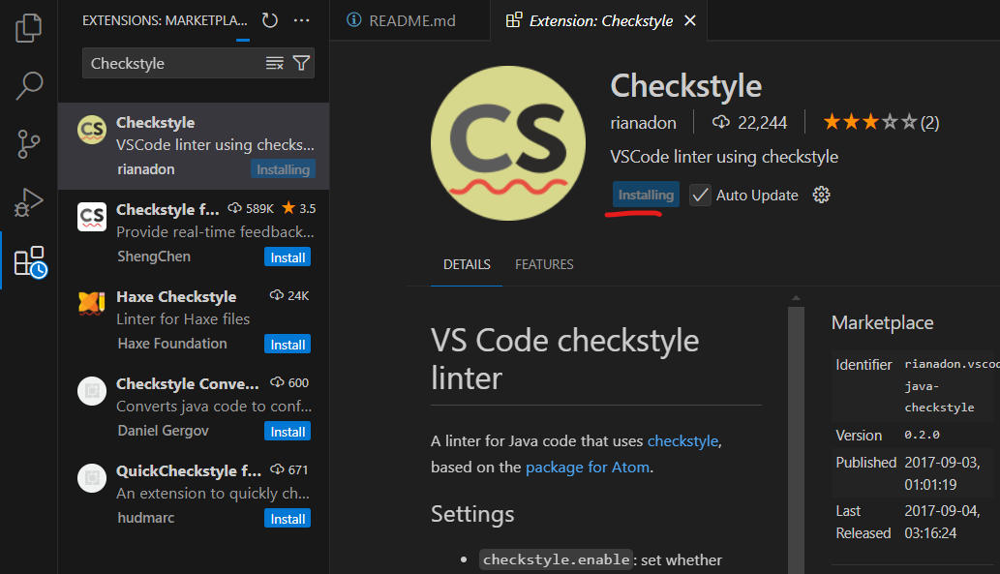
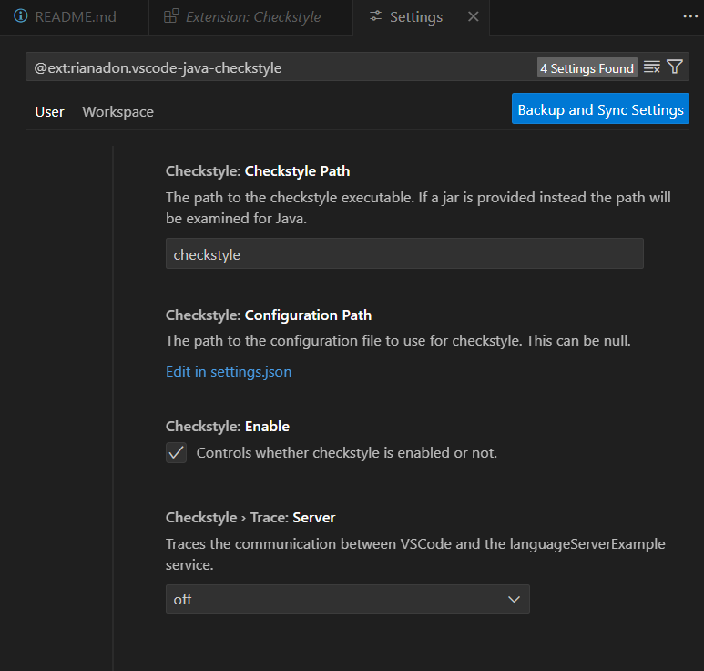
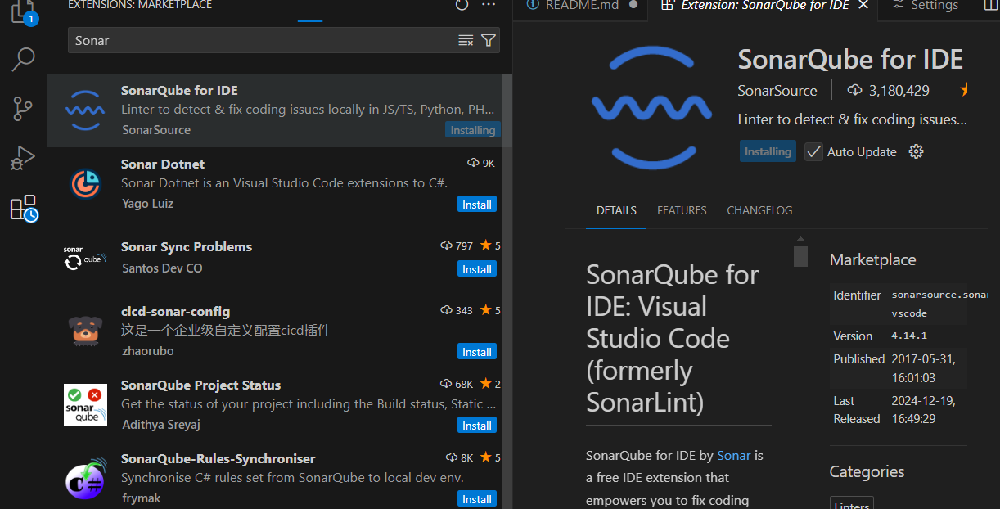
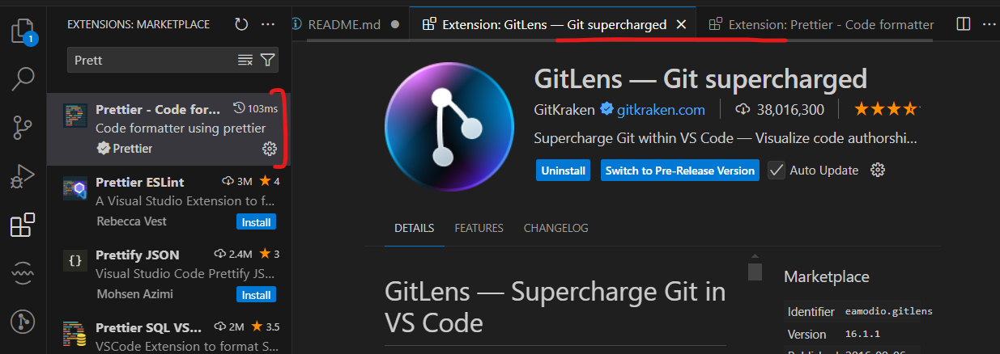
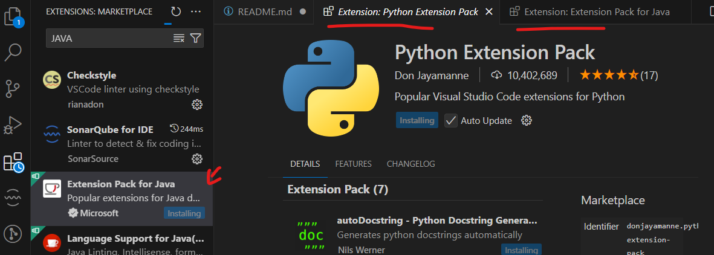
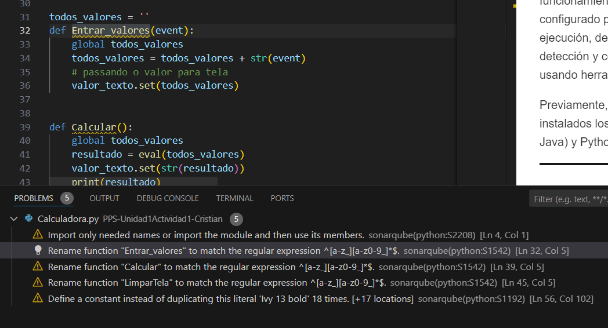

# PPS-Unidad1Actividad1-Cristian

## Índice

- [PPS-Unidad1Actividad1-Cristian](#pps-unidad1actividad1-cristian)
  - [Índice](#índice)
  - [Introducción](#introducción)
  - [Objetivos](#objetivos)
  - [Eclipse con Docker](#eclipse-con-docker)
        - [Creación de carpetas necesarias](#creación-de-carpetas-necesarias)
        - [Configuración del entorno gráfico](#configuración-del-entorno-gráfico)
        - [Lanzamiento del contenedor](#lanzamiento-del-contenedor)
  - [Ejercicio: Instalación y Uso de Extensiones en Visual Studio Code](#ejercicio-instalación-y-uso-de-extensiones-en-visual-studio-code)
  - [Ejercicio: Prueba del Entorno Visual Studio Code](#ejercicio-prueba-del-entorno-visual-studio-code)

---

## Introducción

En esta actividad de la Unidad 1 del curso "Puesta en Producción Segura", nos enfocaremos en la configuración y uso de entornos de desarrollo. El objetivo principal es familiarizarnos con la creación y gestión de entornos de desarrollo integrados (IDE) utilizando herramientas modernas como Docker. A lo largo de esta actividad, realizaremos las siguientes tareas:

- **Crear un entorno de desarrollo Eclipse utilizando Docker**: Configuraremos un contenedor Docker que ejecute Eclipse, permitiendo un entorno de desarrollo aislado y reproducible.

- **Instalar extensiones en el IDE**: Aprenderemos a ampliar las funcionalidades del IDE mediante la instalación de plugins o extensiones que faciliten el desarrollo.

- **Probar los entornos de desarrollo**: Verificaremos que los entornos configurados funcionan correctamente, realizando pruebas que aseguren su operatividad.

## Objetivos

Los objetivos principales de esta actividad son los siguientes:

1. **Configurar un entorno de desarrollo aislado mediante Docker**  
   - Comprender cómo Docker puede ser utilizado para la creación de entornos de desarrollo reproducibles y aislados.
   - Configurar un contenedor con Eclipse, permitiendo su uso sin interferencias con el sistema operativo anfitrión.

2. **Familiarizarse con la gestión de extensiones en un IDE**  
   - Aprender a instalar y gestionar extensiones en Eclipse para añadir funcionalidades adicionales al entorno de desarrollo.
   - Explorar cómo estas extensiones pueden facilitar tareas específicas del proceso de desarrollo.

3. **Probar y validar la funcionalidad del entorno configurado**  
   - Realizar pruebas para garantizar que el entorno de desarrollo cumple con los requisitos establecidos.
   - Verificar que las configuraciones realizadas son correctas y permiten trabajar de manera eficiente.

4. **Desarrollar habilidades prácticas en el uso de herramientas modernas**  
   - Ganar experiencia en la integración de herramientas como Docker en el flujo de trabajo.
   - Entender las ventajas que ofrecen los entornos en contenedores para el desarrollo de software.

5. **Promover buenas prácticas en la gestión de entornos de desarrollo**  
   - Fomentar el uso de técnicas y herramientas que aseguren consistencia, seguridad y portabilidad en los entornos de trabajo.

---

## Eclipse con Docker

En este apartado se detallará el proceso para configurar y ejecutar el entorno de desarrollo Eclipse utilizando Docker. A continuación, se describen los pasos necesarios:

##### Creación de carpetas necesarias

1. Crea una carpeta en tu sistema para almacenar los archivos de configuración y proyectos de Eclipse. Por ejemplo:
   ```bash
   mkdir -p ~/eclipse-docker/workspace
   ```
   - **`~/eclipse-docker`**: Directorio principal para el contenedor de Eclipse.
   - **`workspace`**: Carpeta dentro del directorio principal donde se almacenarán los proyectos de Eclipse.

2. Asigna los permisos necesarios para que Docker pueda acceder a estas carpetas:
   ```bash
   chmod -R 777 ~/eclipse-docker
   ```

##### Configuración del entorno gráfico

Para que Eclipse pueda ejecutarse con una interfaz gráfica dentro de Docker, es necesario configurar el acceso al servidor gráfico X11:

1. Asegúrate de que el sistema tiene configurado el servidor X11. En sistemas basados en Linux, esto generalmente ya está instalado.

2. Permite que el contenedor Docker acceda al servidor gráfico:
   ```bash
   xhost +local:docker
   ```

3. Verifica que la configuración sea correcta ejecutando un contenedor de prueba que acceda al servidor X11.

##### Lanzamiento del contenedor

1. Descarga una imagen Docker que incluya Eclipse. Puedes utilizar una imagen oficial o personalizada. Por ejemplo:
   ```bash
   docker pull some/eclipse-image
   ```

2. Ejecuta el contenedor con los parámetros adecuados para habilitar la interfaz gráfica y montar las carpetas locales:
   ```bash
    sudo docker run -ti --rm \
            -e DISPLAY=$DISPLAY \
            -e artifactory_host='IP:PUERTO'\
            --name eclipse \
            -v /tmp/.X11-unix:/tmp/.X11-unix \
            -v `pwd`:/workspace \
            -v $HOME/docker/eclipse/datos:/home/developer \
            dockeruc/eclipse	
   ```
   - **``-t``**: Asigna una terminal pseudo-TTY al contenedor, lo que permite la interacción con el terminal.
   - **``-i``**: Mantiene la entrada estándar abierta, útil para interacciones con el contenedor.
   - **``--rm``**: Elimina automáticamente el contenedor cuando se detiene, lo que evita acumular contenedores innecesarios
   - **`-e DISPLAY=$DISPLAY`**: Pasa la configuración del servidor gráfico al contenedor.
   - **``-e artifactory_host='IP:PUERTO'``**: Define una variable de entorno personalizada (artifactory_host) en el contenedor. Puede ser usada dentro del entorno para indicar la dirección de un servidor Artifactory.
   - **`-v /tmp/.X11-unix:/tmp/.X11-unix`**: Comparte el socket de X11 entre la máquina anfitriona y el contenedor para permitir la interacción gráfica.
   - **`-v \pwd:/workspace`**: Monta el directorio actual (`pwd` devuelve el directorio actual) en el contenedor como el `directorio/workspace`. Esto permite compartir archivos entre tu máquina anfitriona y el contenedor.
   - **``-v $HOME/docker/eclipse/datos:/home/developer``**: Monta el directorio ``$HOME/docker/eclipse/datos`` (en tu máquina anfitriona) dentro del contenedor como ``/home/developer``. Esto podría ser útil para almacenar datos persistentes del usuario dentro del contenedor.

3. Una vez lanzado, Eclipse debería abrirse en tu sistema y estar listo para usarse dentro del contenedor Docker.

---

## Ejercicio: Instalación y Uso de Extensiones en Visual Studio Code

En este ejercicio, trabajaremos con extensiones en Visual Studio Code para mejorar la experiencia de desarrollo, hacer nuestro código más seguro y flexible. Nos centraremos en instalar extensiones específicas como **Checkstyle** y **SonarLint**, además de buscar otras extensiones útiles para programadores.
1. **Buscar extensiones para Visual Studio Code**
   - Abrimos **Visual Studio Code** en nuestro equipo.
   - Hacemos clic en el icono de **Extensiones** en la barra lateral izquierda o presionamos `Ctrl+Shift+X`.
   - En la barra de búsqueda, escribimos palabras clave para encontrar extensiones deseadas:
   - Podemos revisar las descripciones y valoraciones de las extensiones más recomendadas para nuestro lenguaje de programación o necesidades.

<p align="center">
    
</p>
<p align="center"><em>Buscar e instalar una extensión en VS Code</em></p>

2. **Instalación de `Checkstyle`**
    - Buscamos `Checkstyle` en la tienda de extensiones de Visual Studio Code.
    - Seleccionamos la extensión relevante (puede estar vinculada a herramientas de análisis de código Java).
    - Instalamos la extensión haciendo clic en **Instalar**.
    - Configuramos la extensión según nuestras necesidades:
     - Por ejemplo, podemos añadir reglas de estilo, activar seguimiento de comunicación o importar un archivo de configuración de `Checkstyle`.

<p align="center">
    
</p>
<p align="center"><em>Descargar checkstyle</em></p>

<p align="center">
    
</p>
<p align="center"><em>Configuraciones de la extensión checkstyle</em></p>

3. **Instalación de ``Sonar``**
    - Buscamos ``Sonar`` en la tienda de extensiones.
    - Seleccionamos la extensión oficial de **``Sonar``** y hacemos clic en **Instalar**.
    - Una vez instalada, configuramos el plugin:
        - Podemos vincularlo a un proyecto **``SonarQube``** (opcional).
        - Ajustamos las reglas de análisis de código según nuestro lenguaje.

<p align="center">
    
</p>
<p align="center"><em>Descargar Sonar</em></p>

4. Configuración y prueba de las extensiones
   - Abrimos un archivo o proyecto en Visual Studio Code.
   - Comprobamos que las extensiones están activas:
      - **Checkstyle** nos ayudará a analizar y corregir problemas de estilo en el código.
      - **SonarLint** destacará problemas potenciales de calidad y seguridad del código.
   - Hacemos ajustes en la configuración si es necesario desde la sección de **Configuraciones** (`Ctrl+,`).

5. Añadir otras extensiones útiles
   - Buscamos otras extensiones que puedan ser relevantes para nuestro flujo de trabajo. Algunas recomendaciones:
      - **Prettier**: Para formateo de código.
      - **Live Server**: Para desarrollo web en tiempo real.
      - **GitLens**: Para mejorar la integración con Git.
   - Instalamos y probamos cada una según sea necesario.

<p align="center">
    
</p>
<p align="center"><em>Descargando más extensiones</em></p>

Ahora, tendremos instaladas y configuradas extensiones que facilitarán nuestro desarrollo en ``Visual Studio Code``. Además, habremos probado extensiones específicas como ``Checkstyle`` y ``SonarLint``, mejorando la calidad y el estilo de nuestro código.

---

## Ejercicio: Prueba del Entorno Visual Studio Code

El objetivo de este apartado es comprobar el correcto funcionamiento del entorno de desarrollo que hemos configurado previamente, realizando tareas como compilación, ejecución, depuración y análisis de código. Esto incluye la detección y corrección de errores y problemas de seguridad usando herramientas y extensiones del IDE.

Previamente, debemos estar seguros de que tenemos instalados los paquetes Java Extension Pack (para proyectos Java) y Python Extension (para proyectos Python).

<p align="center">
    
</p>
<p align="center"><em>Descargando paquetes de lenguajes</em></p>

A continuación, visualizaremos alguno de los proyectos de python para comprobar el comportamiento de estas extensiones. Con el proyecto de la calculadora podemos ver que el IDE nos muestra unas advertencias que representan incumplimientos de buenas prácticas en tu código Python, en este caso, por parte de la extensión de Sonar:
 - `Import only needed names or import the module and then use its members`: indica que el código está importando algo innecesario o que no se está utilizando correctamente el módulo o las funciones importadas, puesto que estamos importandolo todo con el `*`.
 - `Rename function "Entrar_valores" to match the regular expression ^[a-z_][a-z0-9_]*$`: La función ``Entrar_valores`` no sigue las convenciones de nomenclatura de Python, también conocidas como PEP 8. Según PEP 8, los nombres de las funciones deben estar en minúsculas y utilizar guiones bajos para separar palabras, es decir, `entrar_valores`. Pasa lo mismo con las funciones `Calcular` y `LimparTela`.
 - `Define a constant instead of duplicating this literal "Ivy 13 bold" 18 times [+17 locations]`: La cadena ``Ivy 13 bold`` se utiliza repetidamente (18 veces) en el código. Esto va en contra de las buenas prácticas porque genera redundancia y dificulta el mantenimiento.

<p align="center">
    
</p>
<p align="center"><em>Sugerencias de mejoras en el código para unas buenas prácticas</em></p>